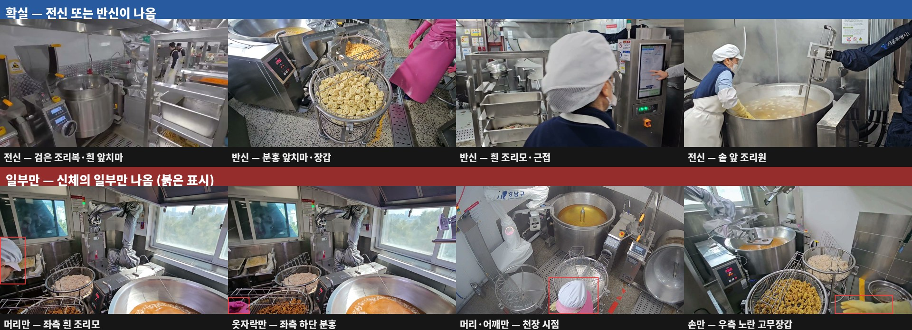
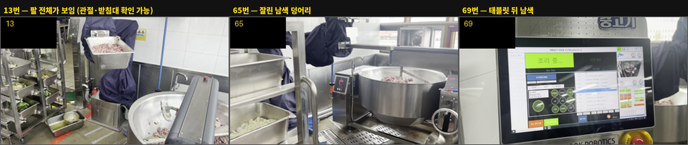

# 조리로봇 사람 인식 — 작업 범위 안전 PoC

> **진행 중.** 2026-08-06 착수. 2026-08-07 기성 YOLO 1차 측정 완료.

급식 조리 교반기 로봇의 작업 범위에 사람이 들어올 때 로봇을 멈추기 위한 인식 모델.
끼임·충돌·솥에 빠지는 사고를 막는 것이 목적임.

앞선 저장소([kitchen-fire-poc](https://github.com/K-H-MOON/kitchen-fire-poc))에서
화염 탐지를 10회차까지 진행한 뒤, 2026-08-06 로보틱스 회의에서 **로봇-사람 안전**을
현실 문제로 잡으면서 주제가 바뀜. 화재는 실제로 낼 수 없어 웹3D 시뮬로 가능성을
시연하는 쪽으로 남기고, 인식 쪽 역량을 사람 판별에 씀.

---

## 결과

| 라인 | 상태 | 근거 |
|---|---|---|
| **기성 YOLO 사람 탐지** | **미통과** | 인식률 91.7% (조건 1 통과) · 연속 미탐 최악 2프레임 (조건 2 실패) |
| **로봇 팔을 사람으로 오인** | **확인됨 · 예측 적중** | 사람 0명 영상에서 오탐 46.9% / 73.2%. **오탐 385장 전수 확인 결과 379장이 로봇 팔, 예외 0건** |
| **부분 노출 사람 인식** | **취약 확인** | 몸통이 이어져 보이면 **100.0%** (92장), 신체 일부만 보이면 **88.0%** (258장) |
| **임계값·모델 크기로 분리** | **불가 확인** | 오탐 신뢰도 0.9 까지 · 큰 모델일수록 오탐 증가 |
| **라벨 신뢰도** | **양방향 검증 완료** | 사람 없음 762장 전수 재확인 · 노출 정도 350장 재분류 · 라벨 오류 9장 정정 |
| **가림 상황 탐지** | 미착수 | 미탐 28장 분류에서 자료 확보 |
| **다중 프레임 추적** | 미착수 | 탐지 결과가 먼저 나와야 기법 선택 가능 |
| **작업 범위 판정** | 규격 재사용 예정 | 화재 5단계 JSON 의 화구 영역 판정을 작업 범위로 전용 |
| **웹3D 카메라 시점** | 미착수 | 카메라 뷰 렌더가 모델 입력이 됨 |
| **합성 학습** | 미착수 | 시뮬 렌더로 정답 좌표를 함께 얻는 경로를 우선 검토 |

전체 수치와 해석은 [PREREGISTER_PERSON1.md](docs/PREREGISTER_PERSON1.md)의 채점 결과에 있음.

### 요약

**모델은 천 씌운 로봇 팔을 신뢰도 0.9 로 사람이라 인식하고, 화면 구석에 부분만 보이는
실제 사람은 놓침.** 인식률은 이미 기준을 넘었으며, 막고 있는 것은 이 두 가지임.

**몸통이 이어져 보이는 사람은 하나도 놓치지 않음(92장 중 92장).** 놓치는 것은 전부
신체 일부만 화면에 걸린 경우이며, 천장에서 내려다본 개원중 CCTV 가 65.7% 로 가장 낮음.

로봇이 자기 팔을 사람으로 보면 정지하고, 팔은 화면에서 사라지지 않으므로
**영구 정지**가 됨. 오탐률 수치의 문제가 아님.

### 다음 회차의 방향이 통상적인 것과 반대임

파인튜닝이 필요하나 목표가 **"사람을 더 잘 잡게"가 아니라 "로봇 팔은 사람이 아니라고
배우게"** 하는 것임. 화재 실험이 10회차 종료 시점에 "조리복 negative 가 유일한 경로"로
결론 났던 것과 같은 자리임.

**비전 밖의 경로도 있음** — 로봇은 관절 각도로 자기 팔 위치를 이미 알고 있으므로,
카메라와 로봇 좌표를 정합하면 팔 영역을 탐지에서 제외할 수 있음. 파인튜닝보다 싸고
확실하나 **팔 뒤의 사람이 함께 지워짐.** 로보틱스 측 자료 확인이 필요함.

---

## 문제

로봇은 정해진 궤적으로 솥을 젓고 기울임. 그 범위에 사람이 들어오면 멈춰야 함.
문제는 **급식실에서 사람을 보는 조건이 일반적인 사람 탐지와 다르다**는 것임.

- 카메라가 위에 있으면 **머리와 어깨만** 보임. 전신이 안 나옴
- **조리복**이 몸의 윤곽을 지움. 색과 형태가 급식실마다 다름
- 조리기구·선반·증기에 **자주 가려짐**
- 사람이 솥에 접근하는 순간이 가장 중요한데, 그때가 **가장 많이 가려지는 순간**이기도 함

회의에서 지목된 연구 포인트가 이 지점임.

## 안전 과제라 화재와 손실 구조가 반대

화재 실험 10회차 내내 싸운 상대는 **오탐**이었음. 헛울리면 조리사가 경보를 무시하게
되어 시스템이 무력화되기 때문임. 그래서 판별비(정탐률 ÷ 오탐률)를 만들고 오탐을
88.0%에서 1.3%까지 밀었음.

**이번 과제는 비대칭이 반대임.** 사람을 못 잡으면 사고이고, 헛잡으면 로봇이 괜히
멈춤. 손실 크기가 비교되지 않음. **화재 때 쓰던 지표를 그대로 가져오면 방향이
거꾸로 잡히므로**, 미탐을 극도로 싫어하는 쪽으로 기준을 새로 세움.

다만 예외가 하나 있음 — 오탐이 로봇 커버 같은 **고정 물체**에서 지속적으로 나오면
로봇이 영구 정지하는 것이므로 그때는 별도 문제로 다룸. 화재 10회차에서 흰 방진복
로봇 커버를 화염으로 잡은 전례가 있음.

## 안전에 걸리는 값은 총 지연 하나

    총 지연 = 탐지 공백 + 모델 응답시간 + 로봇 정지 시간

이 저장소가 재는 것은 **첫 항목 하나뿐**임. 두 번째는 로보틱스가 줄이려는 대상이고
세 번째는 기구 사양임. 세 항목의 예산 배분은 합의가 필요하며, 현재는 임의 값으로
진행하고 그 사실을 사전 등록에 기록해 둠.

---

## 평가 설계

**프레임 단위 사람 있음/없음**을 손으로 표시해 정답으로 삼음. 지표는 셋.

| 지표 | 정의 |
|---|---|
| 인식률 | 사람이 보이는 프레임 중 person 박스가 하나라도 나온 비율 |
| 오탐률 | 사람이 안 보이는 프레임 중 person 박스가 나온 비율 |
| **최장 연속 미탐** | 사람이 보이는 구간에서 연속으로 놓친 프레임 수 |

세 번째가 안전 의미를 지고 있음. 인식률이 같아도 **놓친 프레임이 흩어져 있는지
뭉쳐 있는지**에 따라 위험이 완전히 다름. 뭉쳐 있으면 사람이 접근하는 몇 초가
통째로 안 보임.

앞선 실험에서 이 구분을 실제로 겪었음 — 화재 시간축 측정에서 **프레임 인식률
49.7%인 가중치가 사건 단위로는 8건 중 8건**을 잡았음. 놓친 프레임이 흩어져 있어
사건마다 어딘가에서는 걸렸기 때문임.

### 라벨을 만든 방법

자동 라벨링을 쓰지 않음. **사람이 프레임을 하나씩 보고 정함.**

1. 영상에서 1fps 로 프레임 추출, 원본 해상도 유지
2. 프레임 30장씩 번호를 붙여 **컨택트시트**로 묶음 (6x5 격자, 칸 폭 320픽셀)
3. 시트를 넘기며 사람이 보이는 프레임 번호를 적어 **초안** 작성
4. 애매한 프레임은 **원본을 열어 앞뒤와 비교**해 확정
5. 확정된 것을 **확실히 보임 / 일부만 보임** 두 겹으로 나눔

4번이 핵심임. 컨택트시트의 칸 폭이 320픽셀이라 화면 구석에 조리복 자락이 조금
걸린 정도는 보이지 않음. 실제로 개원중 98번은 97번에 없던 분홍색이 우측 하단에
조금 나타난 것이었고, 113번은 112·114번에 없는 것이 113번에만 있었음.
**앞뒤 프레임과 비교해야 판별되는 종류이며, 시트만 훑으면 전부 "사람 없음"이 됨.**

5번의 분류 기준은 **몸이 화면에 어디까지 나오는가**임.

| 분류 | 기준 |
|---|---|
| **확실** | 몸통이 보이고 팔이나 다리가 이어져 있음. **머리는 없어도 됨** |
| **일부만** | 이어진 부위 없이 조각만 보임 — 앞치마 자락만, 장갑만, 조리모만 |

**크기가 아니라 노출 범위가 기준임.** 멀리 있어도 몸이 통째로 보이면 확실이고,
화면 절반을 차지해도 머리만 보이면 일부만임.



*위: 확실 — 전신 또는 반신이 나와 사람임을 알아볼 근거가 프레임 안에 있음.
아래: 일부만 — 붉은 표시가 화면에 나온 유일한 신체 부분임. 머리만, 옷자락만,
머리와 어깨만, 손만.*

판별이 어려웠는지가 아니라 **무엇이 찍혀 있는지**로 나눔. 보는 사람의 판별 과정에
기대는 기준은 작업자마다 달라지며, 측정 목적에도 맞지 않음 — 알고자 하는 것은
"탐지기가 몸의 일부만으로 사람을 잡는가"이지 "사람이 판별하기 어려웠는가"가 아님.

기록 형식은 **번호만 적으면 확실, 괄호 안에 무엇이 보이는지 적으면 일부만**으로 통일함.

5번의 두 겹 라벨은 나중에 인식률을 **전체가 보이는 사람**과 **일부만 보이는 사람**으로
나눠 내기 위한 것임. 회의에서 연구 포인트로 지목된 "위에서 봐서 머리만 보이거나
조리복에 가려 형체가 뭉개지는 상황"이 두 번째 무리에 해당함. 합쳐서 하나의 숫자로
내면 그 구분이 사라짐.

### 라벨 기준이 일반적인 데이터셋보다 엄격함

**"극히 일부가 미세하게 보이는" 프레임도 사람 있음으로 셈.** 그리고 그런 프레임은
**앞뒤 프레임을 대조해야만 발견됨** — 개원중 98번은 97번에 없던 분홍색이 우측 하단에
조금 나타난 것이고, 113번은 112·114번에 없는 것이 113번에만 있었음.

이 기준을 택한 이유는 **안전 과제이기 때문**임. 조리사의 손이 화면 구석에 조금 걸린
상황은 실제로 사람이 로봇 작업 범위 근처에 있다는 뜻이며, 그것을 사람 없음으로 세면
측정이 현실과 어긋남.

**대가가 둘 있음.** 인식률이 느슨한 기준을 쓸 때보다 낮게 나옴 — 사람 있음 350장 중
258장이 "신체 일부만"임. 그리고 **다른 벤치마크 수치와 직접 비교할 수 없음.**
COCO 같은 공개 데이터셋은 이 정도로 작은 조각을 사람으로 라벨하지 않으므로,
이 저장소의 88.0% 를 다른 곳의 인식률과 나란히 놓으면 안 됨.

### 라벨을 양방향으로 검증함 (2026-08-07)

첫 채점 후 **라벨에 기대는 모든 수치를 다시 확인함.** 절차와 결과는
[PREREGISTER_PERSON1.md](docs/PREREGISTER_PERSON1.md)의 "전수 검증"에 있으며,
핵심은 **한쪽만 보면 편향된다**는 것임.

라벨 오류를 오탐 이미지에서 찾았는데, 오탐은 정의상 **모델이 탐지한 프레임**임.
따라서 그 방식으로 찾을 수 있는 오류는 모델이 이미 잡은 것뿐이고, **인식률을 올리는
방향의 수정만 발견됨.** 모델도 놓치고 라벨도 놓친 프레임은 "사람 없음 + 탐지 없음"으로
묻혀 아무도 열어보지 않음.

그래서 사각지대 377장을 마저 확인함. 거기서 나온 라벨 오류 3장은 전부 미탐이었고
**인식률을 내림.** 한쪽만 봤다면 영동중 "일부만" 인식률이 92.9% 로 나왔을 것이나
양쪽을 보니 76.5% 였음 — 16%p 부풀려질 뻔했음.

| 구분 | 장수 | 결과 |
|---|---:|---|
| 오탐 (탐지됨) | 385 | 로봇 팔 379 · 라벨 오류 6 · 그 외 0 |
| 사각지대 (탐지 안 됨) | 377 | 사람 없음 374 · 라벨 오류 3 |
| **사람 없음 라벨 전체** | **762** | **전수 확인 · 라벨 오류 9장 정정** |

이어서 **사람 있음 350장의 노출 정도도 전부 다시 판정함.** 구간 단위 라벨이 확실 쪽에
일부만을 섞어 넣고 있었기 때문임. 그 결과 일부만이 **47장에서 258장**으로 늘었음.

### 라벨 작성의 세 가지 규칙

**사람이 정함** — 모델이나 자동 도구로 초벌 라벨을 만들지 않음. 모델 출력을 고치는
방식으로 라벨을 만들면 모델이 못 보는 것을 사람도 못 보게 됨.

**모델을 보기 전에 정함** — 라벨이 확정되기 전에는 어떤 탐지 결과도 실행하지 않음.
일부 영상만 먼저 돌려보는 것도 하지 않음. 나온 수치가 남은 라벨을 끌어당김.

**기대값을 말하지 않음** — 라벨 작업 중에는 회의록·선행 실험 결과·예상 수치를
언급하지 않음. 착수 첫날 실제로 어겨서 규칙으로 세움
([PREREGISTER_PERSON1.md](docs/PREREGISTER_PERSON1.md)).

### 이 방법의 대가

**느림.** 착수 첫날 영상 4개 678프레임을 확정하는 데 하루가 걸림.
남은 4개를 포함하면 1차 8개 영상에 이틀 이상이 소요됨.

느린 것이 설계의 결과임을 명시함. 위 세 규칙을 지키면 반드시 느려지며,
대신 **뒤에 나오는 모든 수치가 이 라벨 위에서 계산되므로** 여기서 아낀 시간은
전부 나중에 틀린 숫자로 돌아옴.

더 빠른 길이 없지는 않음. 웹3D 시뮬에서 사람을 배치해 렌더하면 정답 좌표가 함께
나오므로 라벨 작업 자체가 사라짐. 화재 실험에서는 시뮬이 없어 그 길이 막혀 있었으나
이번에는 열려 있음. 다만 **시뮬 렌더로 만든 라벨은 실제 촬영 자료의 평가에 쓸 수 없음** —
합성으로 학습해 합성으로 평가하면 아무것도 증명되지 않는다는 원칙이 그대로 적용됨.

### 왜 정답 라벨을 YOLO 보다 먼저 만드는가

모델이 그린 박스를 먼저 보면 **모델이 놓친 사람을 사람 눈도 함께 놓침.**
화재 평가군 F 에서 소방서 엠블럼을 화염으로 채점해 인식률 96.4%가 나왔던 사고가
같은 종류였음. 이미지를 열어보고 나서야 발견했고, 잘라내니 21.4%로 떨어졌음.

### 라벨 초안이 사람 검수로 뒤집힌 사례 (2026-08-06)

**보조 판정을 사람이 검수해 정정한 기록임.** 라벨 작업 절차가 실제로 작동한
사례이므로 남김.

숭곡중 로봇 전용 영상(사람 없음 자료로 수집)의 컨택트시트를 1차로 훑는 과정에서
**65\~71번 프레임에 "사람의 팔과 어깨로 보이는 것이 있다"고 판정함.** 조작 태블릿
뒤쪽에 남색 형체가 잡혀 있었기 때문임.

자료를 수집한 사람이 이를 검수하고 **"남색 천을 씌운 로봇 팔이며 각도가 달라
사람처럼 보이는 것"이라고 지적함.** 해당 프레임을 3배로 확대해 다시 확인한 결과
관절과 받침대가 이어져 있는 기계 구조물임이 드러났고, 사람 머리가 어디에도 없었음.
**71프레임 전체를 사람 없음으로 정정함.**



*왼쪽: 팔 전체가 보여 기계임이 드러나는 13번. 가운데·오른쪽: 잘리거나 배경에 걸려
사람의 팔과 어깨로 오인했던 65·69번. **같은 물체이며 노출 정도만 다름.***

남기는 이유는 세 가지임.

**첫째, 축소 화면만으로 라벨을 확정하면 안 된다는 것이 확인됨.** 컨택트시트의 칸 폭은
320픽셀이며 그 크기에서는 형체가 뭉개짐. 애매한 프레임은 원본을 열어야 함.

**둘째, 이 오인 자체가 측정 전 예측이 기술하는 실패 방식과 같음.** 천이 덮인 관절
구조물이 사람 형상으로 읽히는 현상이 사람 눈에서 실제로 일어남. 탐지기는 입력을
640픽셀로 줄여 보므로 같은 조건에 놓임
([PREREGISTER_PERSON1.md](docs/PREREGISTER_PERSON1.md)의 "측정 전 예측").

**셋째, 정답 라벨도 틀릴 수 있다는 것이 이 저장소의 전제가 됨.** 인식률과 오탐률은
전부 이 라벨을 기준으로 계산되므로, 라벨이 틀리면 모든 수치가 함께 틀림.
자료를 직접 촬영·수집한 사람의 검수가 이 단계에서 필수임.

---

## 주방 조리 로봇 화재 인식에서 이어받는 것

주제가 바뀌었어도 **그대로 쓰는 것**과 **가져오면 안 되는 것**이 갈림.

**그대로 씀**

- **탐지 JSON 규격과 `detect_json.py`** — "박스 중심이 정의된 영역 안에 들어왔는가"를
  판정하는 구조가 그대로임. 화구 영역을 **로봇 작업 범위**로 바꾸고 클래스를
  `fire` → `person` 으로 바꾸면 동작함. 해상도가 다른 카메라 간 좌표 변환은 검증돼 있음
- **사건 병합 로직** — 탐지가 끊겨도 일정 시간 안에 다시 잡히면 같은 사건으로 유지함.
  가림을 넘어 사람을 잇는 문제의 가장 단순한 형태임
- **웹3D 좌표 전이 측정** — 시뮬 렌더가 모델 입력이 될 수 있다는 근거(IoU 유지율 86.4%)
- **측정 방법론 전체** — 사전 등록, 한 회차에 한 변수, 영상 단위 분리,
  학습하지 않은 장소로 따로 평가, 출처별 macro 평균

**가져오면 안 됨**

- **화재 가중치** — `fire` 한 클래스짜리이므로 쓸모없음
- **판별비** — 손실 구조가 반대라 방향이 거꾸로 잡힘
- **시간축 M-of-N** — 규칙을 조일수록 탐지가 1\~6초 늦어지는 것이 측정됨.
  이미 응답시간이 문제로 올라와 있는 과제에 지연을 더할 이유가 없음. 안전 정지는 1-of-1 임
- **화염 합성 방식** — 실제 영상을 오려 붙이는 방식이었고, 그 코드의 결함으로
  **9회차 동안 속이 빈 화염으로 학습**했음. 사람은 접지 그림자·가림 순서·원근 때문에
  훨씬 어려움. 시뮬 렌더로 정답 좌표를 함께 얻는 경로가 더 나음

**화재 때 없던 것이 하나 생김** — 웹3D 시뮬레이터임. 화재는 시뮬이 없어서 오려 붙이는
방식밖에 없었고 그것이 결함의 원인이었음. 이번에는 배치와 정답이 동시에 나오는
경로가 열려 있음.

---

## 진행 상황

**완료**

- ✅ 사전 등록 작성 — 판정 기준·해석 규칙·한계 확정 ([PREREGISTER_PERSON1.md](docs/PREREGISTER_PERSON1.md))
- ✅ 라벨용 컨택트시트 생성 스크립트
- ✅ 기성 YOLO 측정 스크립트 — 인식률·오탐률·최장 연속 미탐, 판정 자동 출력
- ✅ 영상 선정 — 조리 영상 26개 중 **사람 등장 15개 + 로봇 전용 2개**
- ✅ 프레임 추출 — 1fps, 원본 해상도 유지. 긴 영상은 앞 4분으로 제한
- ✅ 컨택트시트 생성 — 1차 8개 영상
- ✅ **로봇 전용 2개 라벨 확정** — 152프레임 전부 사람 없음. 1차 판정을 사람 검수로 정정
- ✅ **측정 전 예측 기록** — 천 덮인 로봇 팔이 person 으로 잡힐 것, 팔 노출 정도에 따라 갈릴 것
- ✅ 노출 정도별 오탐 분석을 측정 스크립트에 추가
- ✅ **8개 영상 1,103프레임 라벨 확정** — 초안 작성 후 원본 검수까지 마침

전수 검증 후 확정된 라벨임.

| 영상 | 프레임 | 사람 있음 | 확실 / 일부만 | 사람 없음 |
|---|---:|---:|---:|---:|
| `gaewon_cctv_in` | 240 | 65 | 30 / 35 | 175 |
| `yeongdong_soup` | 286 | 171 | 34 / 137 | 115 |
| `sunggok_soup_in1` | 91 | 26 | 2 / 24 | 65 |
| `ulsan_stir_in` | 61 | 58 | 15 / 43 | 3 |
| `robot_fry_in` | 33 | 3 | 0 / 3 | 30 |
| `wonchon_fry_full` | 240 | 27 | 11 / 16 | 213 |
| `np_sunggok_stir` | 71 | 0 | — | 71 |
| `np_inhwa_stir` | 81 | 0 | — | 81 |
| **합계** | **1,103** | **350** | **92 / 258** | **753** |

- ✅ **기성 YOLO 채점** — yolov8n / s / x · conf 0.10 / 0.25 / 0.50
- ✅ **사전 등록 판정** — 조건 1 통과, 조건 2 실패로 **미통과**
- ✅ **오탐 정체 규명** — np 두 영상 오탐 60장 전수 확인, 전부 로봇 팔 커버
- ✅ **미탐 31장 전수 확인** — 구석에 조금만 26 · 멀리 있음 5 · **가려짐 0**
- ✅ **파인튜닝 필요 여부 판단** — 필요. 방향은 로봇 팔 negative
- ✅ **오탐 385장 전수 확인** — 로봇 팔 379 · 라벨 오류 6 · 그 외 0
- ✅ **사각지대 377장 전수 확인** — 라벨 오류 3. 편향이 실재했음이 확인됨
- ✅ **노출 정도 350장 재분류** — 일부만 47 → 258장. 구간 라벨의 오염 제거

**진행 중**

- ⬜ 로봇 팔 노출 정도 라벨 (`ARM_PARTIAL`) — 오탐이 팔 노출 정도에 따라 갈리는지
- ⬜ 2회차 설계 — 로봇 팔 negative 파인튜닝. 박스 라벨 필요
- ⬜ 지연 예산 합의 — 탐지 공백 / 응답시간 / 정지 시간

**미착수**

- ⬜ 조리실 방문 촬영 — 로봇 작업 범위에 사람이 들어오는 장면 확보
- ⬜ 가림 상황 추적 기법 조사
- ⬜ 웹3D 카메라 시점 렌더로 합성 학습셋 생성
- ⬜ 작업 범위 판정 — 화재 5단계 JSON 규격 전용

---

## 원칙

앞선 저장소에서 그대로 가져옴. 주제가 바뀌어도 측정을 믿을 수 있게 만드는 조건은 같음.

**판정 기준을 결과보다 먼저 확정** — 통과선·해석 규칙·예상되는 한계를 사전 등록에
적고 채점 후 수정하지 않음. 바꿔야 할 사정이 생기면 지우지 않고 **개정 이력**으로 남김.

**정답 라벨을 모델 출력보다 먼저 작성** — 모델이 그린 박스를 보고 정답을 정하면
모델이 놓친 것을 함께 놓치게 됨.

**학습·평가는 영상 단위 분리** — 연속 프레임은 배경이 거의 같아 프레임 단위
분리로는 누수를 막지 못함. 조리실 방문 촬영에서도 **일부 시점은 학습에 쓰지 않고
평가용으로 봉인**할 것.

**한 회차에 한 변수만 변경** — 화재 2회차에서 다섯 가지를 동시에 바꿔 원인 특정에
실패한 뒤 도입한 원칙임.

**불리한 수치도 함께 공개** — 실패한 회차와 틀린 진단을 지우지 않음.
무엇이 안 되는지를 아는 것도 결과임.

**숫자만 보고 판단하지 않음** — 화재 실험에서 판정이 뒤집힌 세 번이 전부 이미지를
열어봤을 때였음. 8회차의 산불 오인, 평가군 F 의 엠블럼 오탐, 9회차의 틀린 원인 진단.

---

## 한계

착수 시점에 이미 알고 있는 것들임. 측정이 진행되면 갱신함.

**기존 영상에 목표 상황이 거의 없음** — 로봇 작업 범위에 사람이 들어오는 장면이
사실상 없음. 기존 CCTV 는 로봇 작업용이라 사람이 솥 근처로 오지 않고, 그 외 영상은
촬영자 시점이라 사람이 잘 안 나옴. **이 측정으로는 정작 재고 싶은 상황을 재지 못함.**
조리실 방문 촬영이 필요한 이유임.

**위에서 본 시점 표본이 사실상 한 곳임** — 연구 포인트로 지목된 "머리만 보이는 시점"
자료가 개원중 CCTV 하나뿐임.

**1fps 는 연속성 측정에 거침** — 공백을 1초 단위로밖에 못 잼. 운용은 더 높은
촬영 주기를 쓸 예정이므로 이 값은 비관적인 쪽으로 치우쳐 있음.

**프레임 단위 라벨은 박스 위치를 검증하지 않음** — 사람이 있는 프레임에서 박스가
엉뚱한 곳에 걸려도 성공으로 계산됨. 화재 평가군 F 의 엠블럼 사고가 이 구조에서
나왔으므로 미탐·오탐 이미지를 반드시 눈으로 확인함.

**정답 라벨 자체가 틀릴 수 있음** — 라벨은 사람이 축소된 컨택트시트를 보고 만듦.
착수 첫날 실제로 로봇 팔을 사람으로 오인한 라벨 초안이 나왔고 검수로 정정됨.
모든 수치가 이 라벨 위에서 계산되므로, **자료를 직접 수집한 사람의 검수를 거치지 않은
라벨은 신뢰하지 않음.**

**지연 예산이 합의되지 않음** — 통과선 숫자가 임의값임.

**`ulsan_stir_in` 의 오탐률 0.0% 는 읽을 수 없음** — 사람 없음 프레임이 3장뿐임.
사람이 잘 보이는 영상을 대조군으로 넣었으나 오탐 쪽 표본이 거의 없음.

**"일부만" 안에 크기가 극단적으로 다른 것들이 섞여 있음** — 구석의 앞치마 자락과
화면 절반을 차지하는 머리·어깨가 같은 무리임. 탐지기 입장에서 전혀 다른 문제이며
한 무리로 묶으면 그 차이가 지워짐. 크기 기준을 추가하려면 350장을 다시 봐야 하므로
이번에는 넣지 않음.

**미탐 유형 분류가 사람의 서술에 의존함** — "구석에 조금만"과 "멀리 있음"의 경계가
엄밀하지 않음.

**`ARM_PARTIAL` 은 아직 채점하지 않음** — 오탐이 로봇 팔의 노출 정도에 따라 갈리는지는
미확인. 다만 전수 확인 중 관찰된 신뢰도는 **예측과 반대 방향**임 — 팔 전체가 보일 때
0.87\~0.92, 화면 가장자리에 띠처럼 걸릴 때 0.47\~0.51 로, 팔이 많이 보일수록 사람일
확률을 높게 봄.

---

## 폴더 구조

```
docs/
  PREREGISTER_PERSON1.md   기성 YOLO 기준선 사전 등록
scripts/
  colab_contactsheet.py    라벨용 컨택트시트 생성
  colab_yolo_person.py     기성 YOLO 측정 · 판정 출력
notebooks/
```

## 관련 저장소

[kitchen-fire-poc](https://github.com/K-H-MOON/kitchen-fire-poc) — 화염 인식 (종결된 기록).
합성 학습 파이프라인, 평가 설계, 탐지 JSON 규격, 웹3D 전이 측정.
